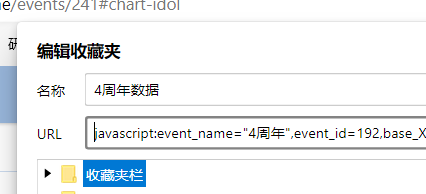
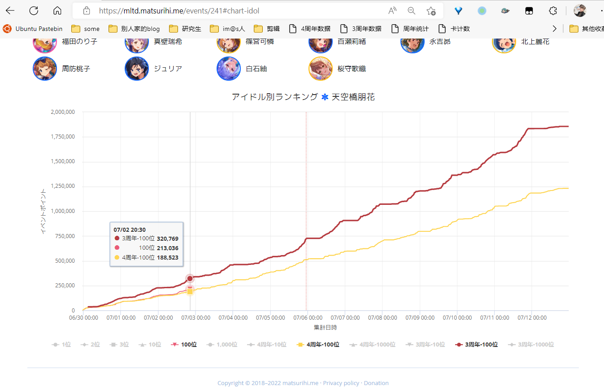

# 周年相关脚本

## 偶像个人往年数据比对

1. 打开 http://tmn07.com/anniv/p4-min.js 全选复制
2. 添加一个书签，名称随意，地址为1中内容
3. 打开https://mltd.matsurihi.me/events/241，点击任意小偶像显示5周年当前档线
4. 点击书签，即可添加4周年数据在图表上

如果还想看3周年数据，将步骤1的地址换成http://tmn07.com/anniv/p3-min.js，其他操作一致

## 周年活动档线排名

仅作参考使用，切勿过分比较

1. 打开http://tmn07.com/anniv/all-min.js, 全选复制

2. 添加一个书签，名称随意，地址为1中内容

3. 打开https://mltd.matsurihi.me/events/241，点击该书签等待即可

   （可能会比较慢，可以在开发者工具-网络中查看网络请求是否正常）

过去四周年数据： [1234周年.xlsx](./1234周年.xlsx) 